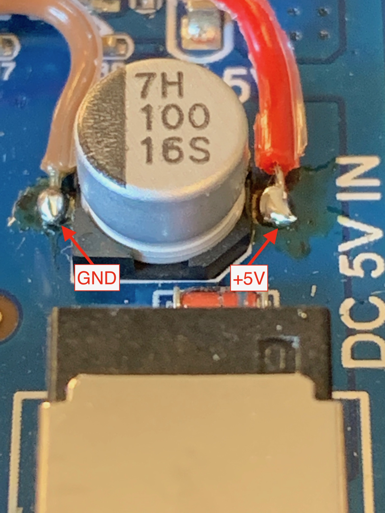

**This repository is no longer maintained and read-only.**

# ESPHome Vorke HD41 integration
This project intergrates a VORKE HD41 into ESPHome. It enables full control of all
over RS232 exposed features which include:

* Switching of the HDMI ports (Auto, Input 1 to 4)
* Switching of the Audio EDID settings (Auto, 2.0, 5.1, 7.1, ARC)
* Detection if a device is connected to a specific port (Input 1 to 4 and Output)

**DISCLAIMER: These modifications might break your device! Follow them on your own
risk and only if you know what you are doing! I am not responsible if you render
your device unusable!**

## Motivation
I wanted to be able to control the HDMI switch through HomeAssistant in a reliable
way. Before coming up with this solution I used a IR blaster which required additional
cabling and ws very unreliable. Also there was no backchannel which reported the
current settings back to HomeAssistant. This is solved by this hack.

## VORKE HD41 Pro
The device is a 4x1 HDMI Switcher. It used to be widely available but I think the
product might be discontinued. The devices might still be available from ebay or
amazon warehouse deals. Also the device is probably sold by other manufacturers
since it looks like an OEM device.

The specs from the manufacturer website:

* HDMI 2.0b
* HDCP 2.2 and HDCP 1.4
* 18Gbps video bandwidth
* Up to 4K@60Hz (YUV 4:4:4), HDR and HDMI-CEC support
* Color Space: YCbCr 4:4:4
* Color Depth: 10 and 12 bit
* HDMI Audio Formats: Passthrough, 2.1CH, 5.1CH, 7.1CH, ARC
* Audio extraction: Stereo and SPDIF

Connectors:

* Inputs: 4x HDMI 2.0 Type A
* Output: 1x HDMI 2.0 Type A
* Audio extraction: 3.5mm Stereo Mini-Jack with SPDIF adapter
* Serial port: RS232 (3.5mm Mini-Jack)
* IR Receiver: 3.5mm Mini-Jack

The VORKE HD41 comes with a RS232 interface with a (incompletely) documented protocol.
You can find the protocol on the VORKE HD41 website at the manufacturers website:
http://www.vorke.com/project/hd-41-pro-support/. There is also the current firmware
version which I used to code against (version 8.6).

## Hardware modifications
After opening the device the MCU can be clearly identified as a STM32F030C8T6. This
MCU runs on 3.3V like the ESP8266 does. Therefore it is easy to interface the ESP8266
to the UART of the STM32. However the serial port exposed by the device is RS232
compatible and thus level shifted by a MAX3232. Directly connecting the ESP8266 to the
RS232 Mini-Jack seems risky and not working due to the level differences. Tracing the
RS232 lines back to the MAX3232 reveals that they are connected to pins 13 (RS232-RX)
and 14 (RS232-TX). The corresponding pins for the MCU interface are pins 11 (MCU-TX)
and 12 (MCU-RX) of the MAX3232. Connecting pins 11 and 12 to the ESP8266 should do the
job. To assure that the MAX3232 output driver does not destroy the ESP8266 output
driver I cut the connection from the MAX3232 pins 11 and 12 to the soldering pads and
connected cables to the ESP8266 GPIO pins. Of course this renders the external RS232
interface unusable! So if you want to be able to still use that either do not cut the
connections (and risk the ESP8266 being damaged) or come up with a proper solution to
connect both, ESP8266 and MAX3232 without destroying each other.


The power is sourced directly from the power supply's smoothing capacitor. This gives
+5V and GND which can be connected to the ESP8266. Alternatively the +3.3V output of
the voltage regulator can be used if your ESP8266 board doesn't contain a voltage
regulator.



I decided on a Wemos D1 mini due to the small form factor. I connected the MCU-RX line
to pin D7 (GPIO13, orange) and the MCU-TX to pin D6 (GPIO12, yellow). Also I connected
5V (red) and G (brown) directly to the power supply of the VORKE HD41.


After flashing the Wemos with ESPhome and making sure I could access it be WiFi I used
some doubled sided sticky tape to attached the Wemos D1 board on an empty space of the
HD41 mainboard. I used some additional tape to keep the wires in place.


That's it for the hardware side.

## The Software
All interfacing is done by two custom ESPHome components which are defined in the file
`vorke_hd41.h`. The following classes are provided:

* `HD41Device` - implements the communication (not exposed)
* `HD41Switch` - provides access to switches (exposed as `switch`)
  * ARC on/off
  * Auto Source Scanning on/off
  * Input 1 to 4 on/off (grouped - switching one on switches the others off)
  * EDID: Auto, 2CH, 5.1CH, 7.1CH (also grouped)
* `HD41BinarySensor` - provides access to the sensors (exposed as `binary_sensor`)
  * Output connected yes/no
  * Input 1 to 4 connected yes/no

The switches report back their _real_ settings, not their _assumed_ states. So if the input
is switched at the devices front panel switches, the new state will be reflected in ESPHome!

## Configuration
The ESPHome `yaml` file must contain the following sections.

### esphome
At the beginning the custom include file needs to be loaded. This provides the interface,
switches and sensors to the core.

```
esphome:
  name: vorke_hd41_demo
  platform: ESP8266
  board: d1_mini
  includes:
    - vorke_hd41.h
```

## uart
The communication requires the UART component which must be initialized with the correct
baud rate and pins used for the communication to the HD41. Note that it is important to
assign an id (here: `uart_bus`) to the component so it can later be referenced.

```
uart:
  id: uart_bus
  tx_pin: D7
  rx_pin: D6
  baud_rate: 19200
```

## HD41 switches
Here define all switches you want to use. This shows _all_ possible switches, but you can
also expose only a subset by modifying the `return` statement along with the `switches`
section. See the ESPHome documentation for details. Note that this section references the
`uart_bus` id in the `HD41Switch` constructor.

```
switch:
  - platform: custom
    lambda: |-
      auto sw = new HD41Switch(id(uart_bus));
      App.register_component(sw);
      return {
        sw->make_switch(HD41Switch::ArcSwitch),
        sw->make_switch(HD41Switch::AutoSourceSwitch),
        sw->make_switch(HD41Switch::Input1Switch),
        sw->make_switch(HD41Switch::Input2Switch),
        sw->make_switch(HD41Switch::Input3Switch),
        sw->make_switch(HD41Switch::Input4Switch),
        sw->make_switch(HD41Switch::AutoEdidSwitch),
        sw->make_switch(HD41Switch::StereoSwitch),
        sw->make_switch(HD41Switch::DolbyDtsSwitch),
        sw->make_switch(HD41Switch::HdAudioSwitch),
      };
    switches:
      - id: arc
        name: "ARC"
        icon: "mdi:audio-video"
      - id: auto_source
        name: "Auto Source"
        icon: "mdi:arrow-decision-auto"
      - id: input_1_source
        name: "Input 1 Source"
        icon: "mdi:video-input-hdmi"
      - id: input_2_source
        name: "Input 2 Source"
        icon: "mdi:video-input-hdmi"
      - id: input_3_source
        name: "Input 3 Source"
        icon: "mdi:video-input-hdmi"
      - id: input_4_source
        name: "Input 4 Source"
        icon: "mdi:video-input-hdmi"
      - id: auto_edid
        name: "Auto EDID"
        icon: "mdi:arrow-decision-auto"
      - id: stereo_2_0
        name: "Stereo (2.0)"
        icon: "mdi:surround-sound-2-0"
      - id: dolby_dts_5_1
        name: "Dolby/DTS (5.1)"
        icon: "mdi:surround-sound-5-1"
      - id: hd_audio_7_1
        name: "HD Audio (7.1)"
        icon: "mdi:surround-sound-7-1"
```

## HD41 sensors
Similar this defines all sensors you want to use. This shows _all_ possible sensors, but
you can also expose only a subset by modifying the `return` statement along with the
`sensors` section. See the ESPHome documentation for details. Note that this section
references the `uart_bus` id in the `HD41BinarySensor` constructor.

```
binary_sensor:
  - platform: custom
    lambda: |-
      auto ps = new HD41BinarySensor(id(uart_bus));
      App.register_component(ps);
      return {
        ps->make_sensor(HD41BinarySensor::OutputConnected),
        ps->make_sensor(HD41BinarySensor::Input1Connected),
        ps->make_sensor(HD41BinarySensor::Input2Connected),
        ps->make_sensor(HD41BinarySensor::Input3Connected),
        ps->make_sensor(HD41BinarySensor::Input4Connected),
      };
    binary_sensors:
      - id: output_connected
        name: "Output Connected"
        device_class: connectivity
      - id: input_1_connected
        name: "Input 1 Connected"
        device_class: connectivity
      - id: input_2_connected
        name: "Input 2 Connected"
        device_class: connectivity
      - id: input_3_connected
        name: "Input 3 Connected"
        device_class: connectivity
      - id: input_4_connected
        name: "Input 4 Connected"
        device_class: connectivity
```

## Example configuration
This is a working example. Adjust the WiFi configuration accordingly. After flashing
find the IP address of the ESP8266 and add the device to HomeAssistant using the ESPHome
integration. All switches and sensors will show up and can be controlled from
HomeAssistant.

```
esphome:
  name: vorke_hd41_demo
  platform: ESP8266
  board: d1_mini
  includes:
    - vorke_hd41.h

api:

wifi:
  ssid: "MY IOT SSID"
  password: "MY WIFI PASSWORD"

logger:

ota:

uart:
  id: uart_bus
  tx_pin: D7
  rx_pin: D6
  baud_rate: 19200

switch:
  - platform: custom
    lambda: |-
      auto sw = new HD41Switch(id(uart_bus));
      App.register_component(sw);
      return {
        sw->make_switch(HD41Switch::ArcSwitch),
        sw->make_switch(HD41Switch::AutoSourceSwitch),
        sw->make_switch(HD41Switch::Input1Switch),
        sw->make_switch(HD41Switch::Input2Switch),
        sw->make_switch(HD41Switch::Input3Switch),
        sw->make_switch(HD41Switch::Input4Switch),
        sw->make_switch(HD41Switch::AutoEdidSwitch),
        sw->make_switch(HD41Switch::StereoSwitch),
        sw->make_switch(HD41Switch::DolbyDtsSwitch),
        sw->make_switch(HD41Switch::HdAudioSwitch),
      };
    switches:
      - id: arc
        name: "ARC"
        icon: "mdi:audio-video"
      - id: auto_source
        name: "Auto Source"
        icon: "mdi:arrow-decision-auto"
      - id: input_1_source
        name: "Input 1 Source"
        icon: "mdi:video-input-hdmi"
      - id: input_2_source
        name: "Input 2 Source"
        icon: "mdi:video-input-hdmi"
      - id: input_3_source
        name: "Input 3 Source"
        icon: "mdi:video-input-hdmi"
      - id: input_4_source
        name: "Input 4 Source"
        icon: "mdi:video-input-hdmi"
      - id: auto_edid
        name: "Auto EDID"
        icon: "mdi:arrow-decision-auto"
      - id: stereo_2_0
        name: "Stereo (2.0)"
        icon: "mdi:surround-sound-2-0"
      - id: dolby_dts_5_1
        name: "Dolby/DTS (5.1)"
        icon: "mdi:surround-sound-5-1"
      - id: hd_audio_7_1
        name: "HD Audio (7.1)"
        icon: "mdi:surround-sound-7-1"

binary_sensor:
  - platform: custom
    lambda: |-
      auto ps = new HD41BinarySensor(id(uart_bus));
      App.register_component(ps);
      return {
        ps->make_sensor(HD41BinarySensor::OutputConnected),
        ps->make_sensor(HD41BinarySensor::Input1Connected),
        ps->make_sensor(HD41BinarySensor::Input2Connected),
        ps->make_sensor(HD41BinarySensor::Input3Connected),
        ps->make_sensor(HD41BinarySensor::Input4Connected),
      };
    binary_sensors:
      - id: output_connected
        name: "Output Connected"
        device_class: connectivity
      - id: input_1_connected
        name: "Input 1 Connected"
        device_class: connectivity
      - id: input_2_connected
        name: "Input 2 Connected"
        device_class: connectivity
      - id: input_3_connected
        name: "Input 3 Connected"
        device_class: connectivity
      - id: input_4_connected
        name: "Input 4 Connected"
        device_class: connectivity
```
